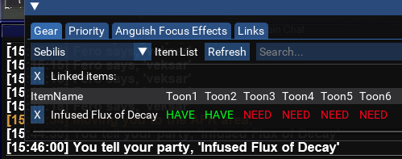
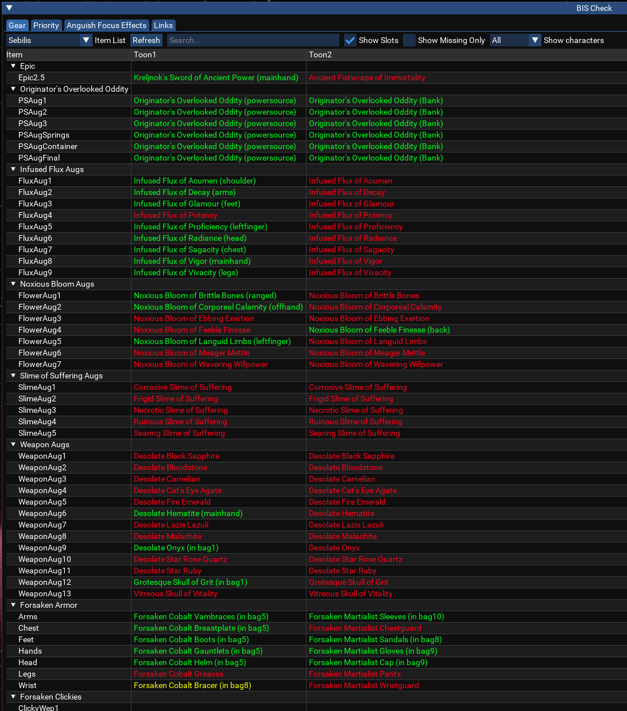
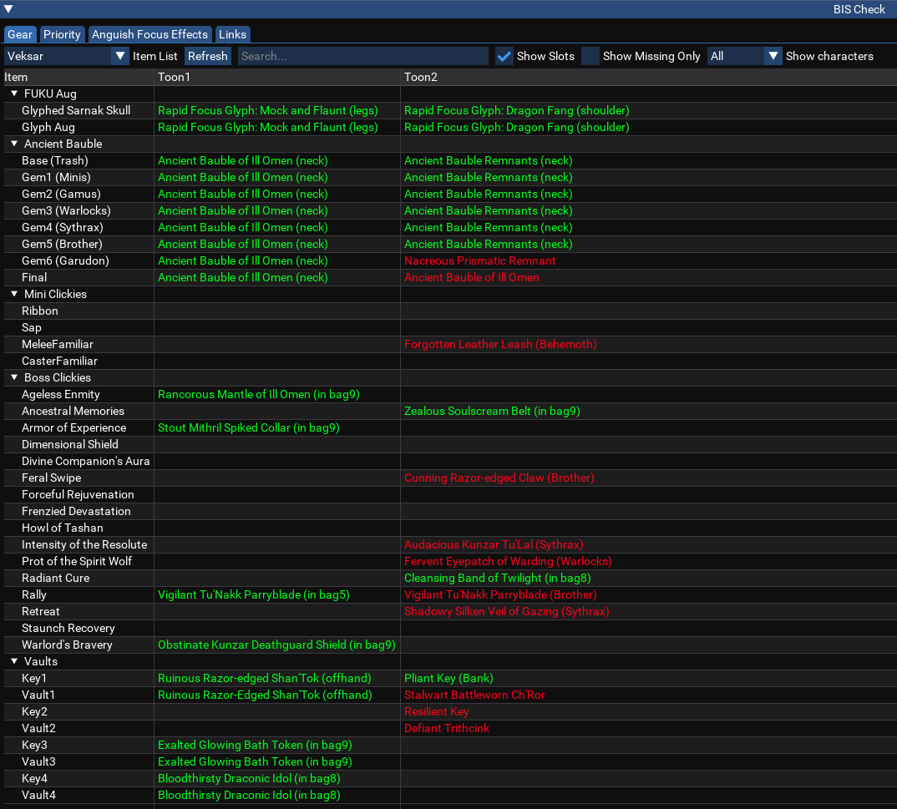
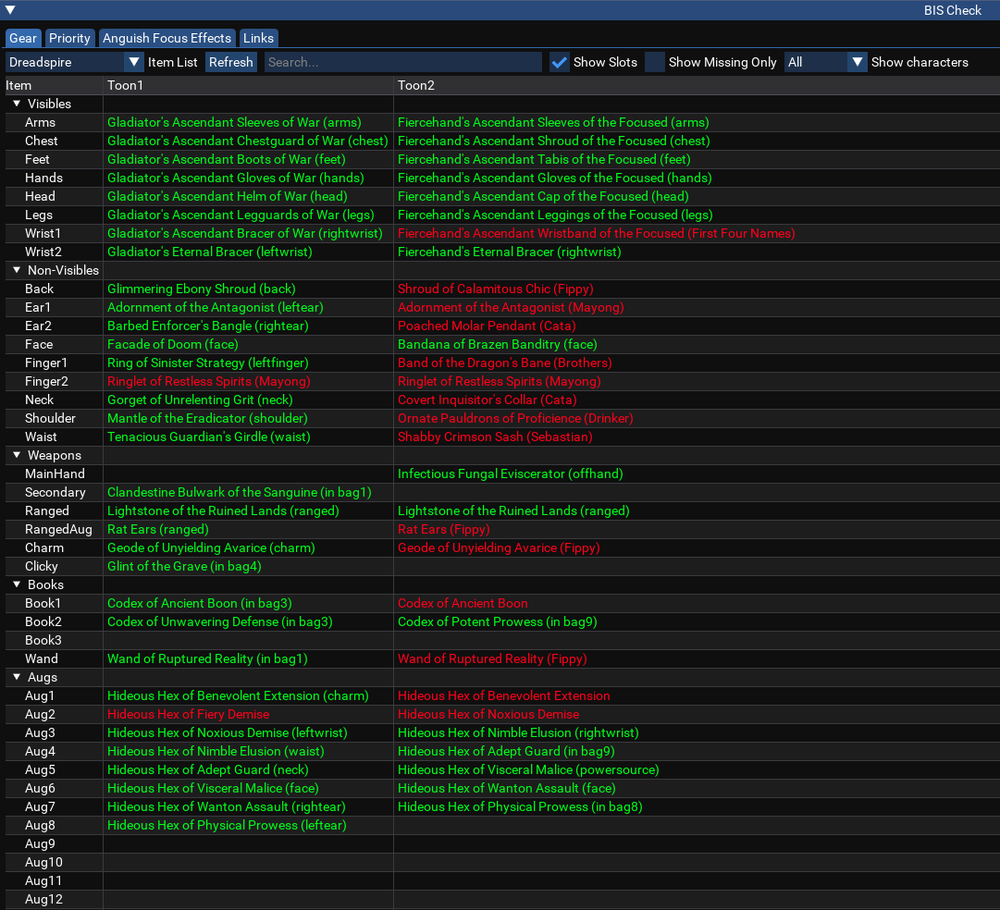

# lazarus_bis
Gotta collect em all

## Credits
Initial anguish and DSK standalone scripts provided by Dlilah and ... from Verticordious.  
Other lists provided by myself, Dlilah and ...  

## Installation

You can install the script by doing either:  
a. Clone the repository to your MacroQuest lua folder, or  
b. Download the ZIP file and unzip it to your MacroQuest lua folder  

Once installed, you should have:  
```
macroquest/
  lua/
    lazbis/
      init.lua
      bis.lua
```

The first time the script is run, it will prompt to install the lsqlite3 LuaRock dependency from the MacroQuest LuaRocks server. This is needed to support the offline data.  

## Usage

Run the script with `/lua run lazbis`.  

You can add a startup command to `ingame.cfg` to have the script update the database whenever a character logs in to keep offline data mostly accurate.  
In your `mq/config/ingame.cfg` (create one if it doesn't exist) add:  
```
/docommand /timed ${Math.Random[10,100]} /lua run lazbis dumpinv
```
The `/timed ${Math.Random[10,100]}` is just to help avoid database conflicts from multiple toons logging in. The script should retry as well anyways.  

## Overview
Lazarus BIS provides a live item tracker for all of your logged in characters.  
It also writes the data to a local sqlite3 db to support showing offline characters as well.  

### Features

- Track who has what items across all currently logged in characters for Anguish, Dreadspire, FUKU, HC Zones, Hand aug, Pre-Anguish, Quest items, Sebilis, Veksar and Vendor items.  
- Track who has what items across offline characters who have run the script at some point in time.  
- Shows who needs an item if the item is linked in chat.  
- Announce who needs an item into chat when an item is linked in chat.  
- Filter what rows are displayed using the search bar. You can search by any item name text in the table such as "infused flux".  
- Show what slots each character has items in. Uncheck the box "Show slots" to hide slot information.  
- Only show items which characters are missing. Check the box "Show Missing Only" to filter out items you already have.  
- Show all characters or only grouped characters. In case you have extra characters logged in like buffers which you don't want to track, you can show only grouped characters from the dropdown menu.  
- Tooltips when hovering over items if the item is showing green because of some other item. For example, if you have crushed an anguish item but you have the Hex aug with that items focus, the item still shows as green.  
- Full stat food, quest and recipe info for new stat food quest on Project Lazarus.  

### How it works

When you start the script on a character, it will automatically broadcast to the rest of your characters to launch the script in the background.  
It will use `/e3bca` by default as long as you have the `mq2mono` plugin (E3Next users). Otherwise it will use `/dge` from MQ2DanNet.  
Once the script has started, it relies on the new-ish built-in communication feature in MQ to send all your characters item info back to the character which launched the script.
Characters will send updated info when the script starts, whenever you click the `refresh` button or when you switch what list you are viewing.

The character which initially started the script will persist all information which it receives from your bots into a local database for querying offline characters later.  

  
  
  
  